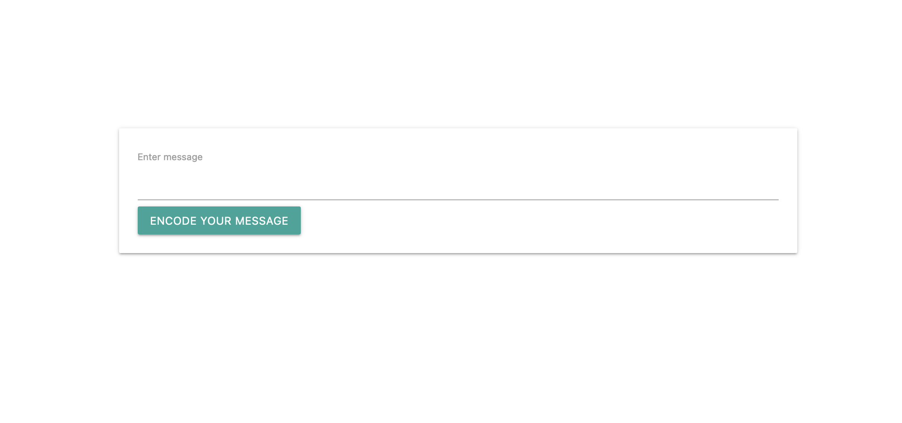

# Encoding and send a messages

Basic message encoding. Getting myself more familiar with binary.

# Created at

December 23, 2022

# Project is created with

- JavaScript
- materialize css

# View on browser

## [https://n00bg1rl.github.io/message/](https://n00bg1rl.github.io/message/)

# View as image

